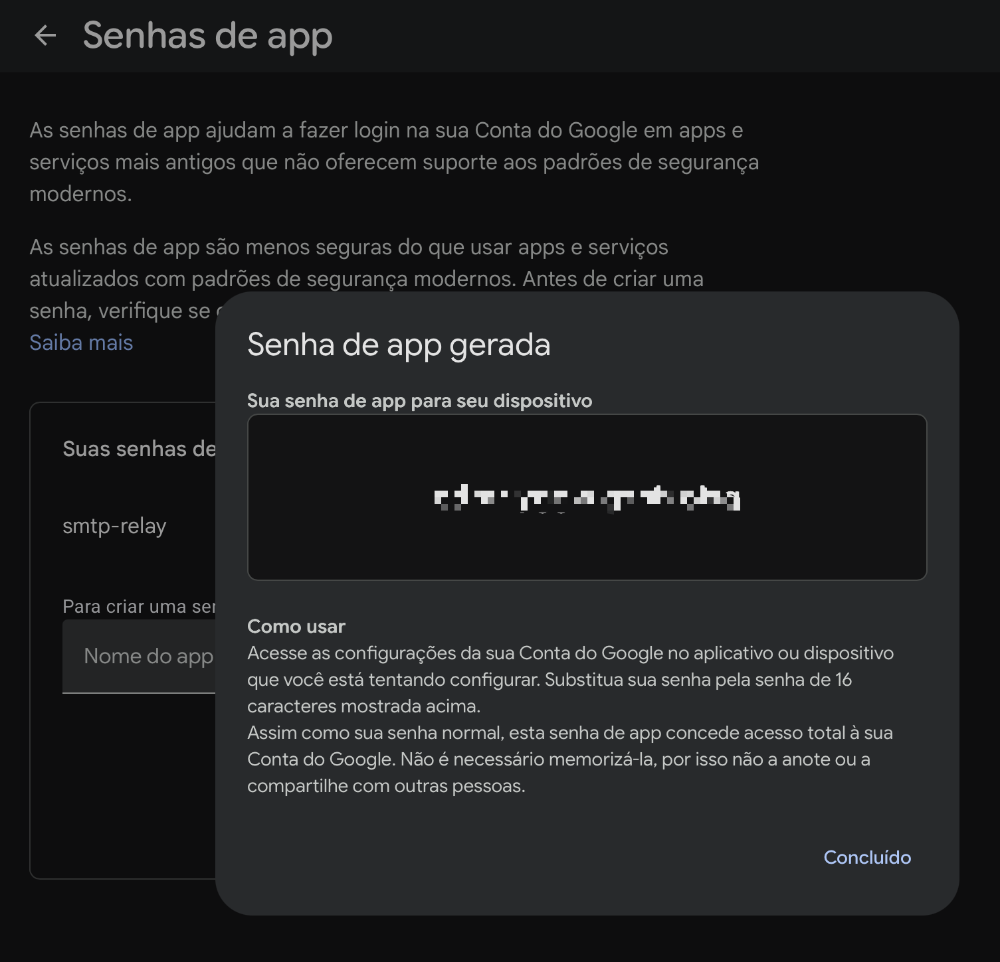
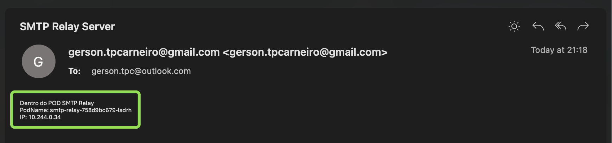
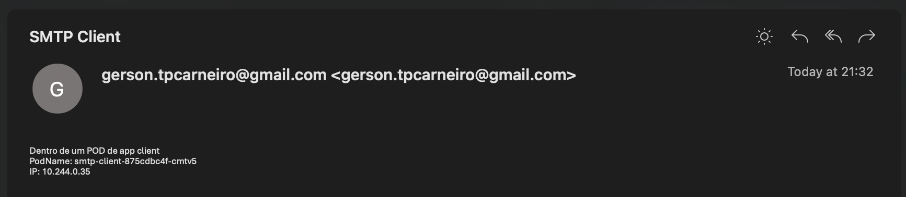

# SMTP Relay Container (Postfix + Gmail)

TL;DR: Projeto para aplicações que precisam enviar e-mails de dentro de um cluster Kubernetes usando um único **SMTP relay** (em vez de cada app ter credenciais próprias). Ele cria um container que se autentica no servidor SMTP (Gmail) via `STARTTLS` + `SASL`, expõe uma entrada SMTP na porta `25` e só permite acesso de namespaces autorizados via NetworkPolicy.

### Diagrama e funcionamento

Este projeto fornece uma imagem de contêiner baseada em Alpine que roda **Postfix** como relay SMTP. O `Deployment` cria um pod que aceita conexões autorizadas por NetworkPolicy na porta `25` e encaminha os e-mail para o Gmail usando `STARTTLS` e autenticação `SASL`.


### Estrutura de diretórios

```sh
.
├── manifests    >> kubernetes manifests
├── smtp-client  >> Dockerfile app-client
└── smtp-relay   >> Dockerfile app-smtp-relay
```

## Como funciona

1. O pod escuta na porta `25` e expõe um serviço `ClusterIP` no cluster (`smtp-relay.smtp-relay.svc.cluster.local`);
2. Aplicações dentro do cluster enviam e-mails para esse serviço;
3. No startup, o `entrypoint.sh` gera `/etc/postfix/sasl_passwd` usando `RELAY_USER` e `RELAY_PASSWORD`, e configura o `main.cf` do Postfix para usar esse arquivo;
4. O Postfix aceita as conexões locais (porta 25), aplica regras básicas de roteamento e, em seguida, encaminha as mensagens para o servidor SMTP upstream (`smtp.gmail.com:587`) usando `STARTTLS` e autenticação `SASL`;

Essa abordagem permite centralizar as credenciais de envio em um único local (o relay), enquanto os demais serviços do cluster apenas falam SMTP sem precisar conhecer a conta do Gmail.

Por padrão, os logs do Postfix são enviados para o `stdout` do container, então ficam disponíveis via `kubectl logs <pod-name> -n smtp-relay`.

## Variáveis de ambiente

| Variável | Descrição |
|----------|-----------|
| `RELAY_USER` | Conta Gmail completa, por exemplo `user@gmail.com` |
| `RELAY_PASSWORD` | `App Password` do Gmail |
| `RELAY_HOST` | Relay upstream. Padrão: `smtp.gmail.com:587` |
| `MYDOMAIN` | Hostname anunciado pelo Postfix |
| `MAILNAME` | Domínio usado em `myorigin`. Padrão: domínio de `RELAY_USER` |
| `MAILLOG_FILE` | Destino dos logs do Postfix. Padrão: `/dev/stdout` |


## Preparando o ambiente

Antes de aplicar os manifestos Kubernetes para criar o ambiente, é necessário configurar o `Secret` com sua conta Gmail e a senha de app. Edite os valores em [manifests/smtp-relay.yaml](manifests/smtp-relay.yaml#L103):

- `user`: conta Gmail completa
- `password`: senha de app (16 caracteres)

**Criando a senha de aplicativo para o GMAIL**

1. Na conta Google (`seu-email@gmail.com`), ative a **Verificação em duas etapas**.
2. Gere uma **Senha de app** em: https://myaccount.google.com/apppasswords
3. Substitua o valor de `password` em [manifests/smtp-relay.yaml](manifests/smtp-relay.yaml#L103) pela senha de app gerada (16 caracteres).



### Criando o SMTP Relay

1. Após adicionar os valores `user` e `password`, aplique o manifesto `manifests/smtp-relay.yaml` para criar os componentes necessários para o **SMTP Relay** (namespace, deployment, service, secret e networkpolicy)

```shell
kubectl apply -f manifests/smtp-relay.yaml

namespace/smtp-relay created
deployment.apps/smtp-relay created
service/smtp-relay created
secret/smtp-relay-credentials created
networkpolicy.networking.k8s.io/allow-smtp-from-app-ns-custom created
```

2. Liste os pods

```shell
kubectl get pods -n smtp-relay -o wide

NAME                         READY   STATUS    RESTARTS   AGE
smtp-relay-758d9bc679-lsdrh   1/1     Running   0          23s
```

3. Execute o comando abaixo para enviar um e-mail de teste através do `POD` do SMTP Relay

```shell
POD=$(kubectl get pod -n smtp-relay -l app=smtp-relay -o jsonpath='{.items[0].metadata.name}')
kubectl exec -i "$POD" -n smtp-relay -- sh -lc 'printf "From: no-reply@localhost\nTo: gerson.tpc@outlook.com\nSubject:SMTP Relay Server\nDentro do POD SMTP Relay\nPodName: $HOSTNAME\nIP: $(hostname -i)\n" | sendmail -v -f no-reply@localhost gerson.tpc@outlook.com && postqueue -p'

Mail Delivery Status Report will be mailed to <no-reply@localhost>.
-Queue ID-  --Size-- ----Arrival Time---- -Sender/Recipient-------
7D8D62058EC     242 Sun Mar 15 00:11:10  no-reply@localhost
                                         gerson.tpc@outlook.com
```

4. Cheque a caixa de e-email

🎉 Chegouuu o e-mail com sucesso!



5. Checando os logs do `POD` do SMTP Server

```sh
POD=$(kubectl get pod -n smtp-relay -l app=smtp-relay -o jsonpath='{.items[0].metadata.name}')
# Logs do pod smtp-relay
kubectl logs "$POD" -n smtp-relay

Mar 15 00:32:16 smtp-relay postfix/cleanup[1073]: 81DC9203BB7: message-id=<13ec6015c0d1112711a91ac335e729f6@gmail.com>
Mar 15 00:32:16 smtp-relay postfix/smtpd[211]: disconnect from unknown[10.244.0.35] ehlo=1 mail=1 rcpt=1 data=1 quit=1 commands=5
Mar 15 00:32:16 smtp-relay postfix/qmgr[190]: 81DC9203BB7: from=<gersontpcarneiro@gmail.com>, size=443, nrcpt=1 (queue active)
Mar 15 00:32:19 smtp-relay postfix/smtp[1074]: 81DC9203BB7: to=<gerson.tpc@outlook.com>, relay=smtp.gmail.com[108.177.123.108]:587, delay=3.3, delays=0.04/0/2/1.3, dsn=2.0.0, status=sent (250 2.0.0 OK  1773534739 5a478bee46e88-2beab3a110csm8339480eec.6 - gsmtp)
Mar 15 00:32:19 smtp-relay postfix/qmgr[190]: 81DC9203BB7: removed

postfix/postlog: starting the Postfix mail system
Mar 15 00:17:50 smtp-relay postfix/master[1]: daemon started -- version 3.8.9, configuration /etc/postfix
Mar 15 00:17:52 smtp-relay postfix/postfix-script[204]: the Postfix mail system is running: PID: 1
Mar 15 00:18:22 smtp-relay postfix/pickup[189]: F161F205527: uid=0 from=<no-reply@localhost>
Mar 15 00:18:22 smtp-relay postfix/cleanup[254]: F161F205527: message-id=<20260315001822.F161F205527@smtp-relay.smtp-relay.svc.cluster.local>
Mar 15 00:18:22 smtp-relay postfix/qmgr[190]: F161F205527: from=<no-reply@localhost>, size=426, nrcpt=1 (queue active)
Mar 15 00:18:26 smtp-relay postfix/smtp[257]: F161F205527: to=<gerson.tpc@outlook.com>, relay=smtp.gmail.com[108.177.123.109]:587, delay=3.7, delays=0.01/0.01/2.2/1.5, dsn=2.0.0, status=sent (250 2.0.0 OK  1773533906 5a478bee46e88-2beab3eec52sm9815368eec.14 - gsmtp)
Mar 15 00:18:26 smtp-relay postfix/cleanup[254]: A90452057FD: message-id=<20260315001826.A90452057FD@smtp-relay.smtp-relay.svc.cluster.local>
Mar 15 00:18:26 smtp-relay postfix/bounce[259]: F161F205527: sender delivery status notification: A90452057FD
Mar 15 00:18:26 smtp-relay postfix/qmgr[190]: A90452057FD: from=<>, size=2370, nrcpt=1 (queue active)
Mar 15 00:18:26 smtp-relay postfix/qmgr[190]: F161F205527: removed
Mar 15 00:18:26 smtp-relay postfix/local[260]: A90452057FD: to=<no-reply@localhost>, relay=local, delay=0.01, delays=0/0/0/0, dsn=5.1.1, status=bounced (unknown user: "no-reply")
Mar 15 00:18:26 smtp-relay postfix/qmgr[190]: A90452057FD: removed
```

### Realizando o teste de um POD de uma aplicação cliente

Será criado um `POD` de aplicação e um namespace `smtp-client` para poder enviar e validar se a `NetworkPolicy` está funcional:

1. Crie o pod de aplicação de cliente
```sh
kubectl apply -f manifests/app-ns-custom.yaml

namespace/app-ns-custom created
deployment.apps/smtp-client created
```

2. Liste os pods com o parâmteto `-o wide` para visualizar o IP do `POD`.

```shell
kubectl get pods -n app-ns-custom -o wide

NAME                          READY   STATUS    RESTARTS   AGE     IP            NODE                 NOMINATED NODE   READINESS GATES
smtp-client-875cdbc4f-cmtv5   1/1     Running   0          6m37s   10.244.0.35   kind-control-plane   <none>           <none>
```

3. Envie um e-mail através do `POD` utilizando o `msmtp` simulando uma aplicação

```sh
# Obtém o nome do primeiro pod com label app=smtp-client
POD=$( kubectl get pod -n app-ns-custom -l app=smtp-client -o jsonpath='{.items[0].metadata.name}') \
# Executa o envio de e-mail a partir do pod
kubectl exec -i "$POD" -n app-ns-custom -- sh -lc 'printf "Subject: SMTP Client\nDentro de um POD de app client\nPodName: $HOSTNAME\nIP: $(hostname -i)\n" | msmtp --host=smtp-relay.smtp-relay.svc.cluster.local  --port=25 -f gersontpcarneiro@gmail.com gerson.tpc@outlook.com'

```

4. Cheque a caixa de e-email

🎉 Chegouuu o e-mail com sucesso!



5. Checando os logs do `POD` SMTP Relay para analisar os detalhes de como fica o log enviado por um pod de aplicação.

```sh
POD=$(kubectl get pod -n smtp-relay -l app=smtp-relay -o jsonpath='{.items[0].metadata.name}')
# Logs do pod smtp-relay
kubectl logs "$POD" -n smtp-relay

Mar 15 00:32:16 smtp-relay postfix/cleanup[1073]: 81DC9203BB7: message-id=<13ec6015c0d1112711a91ac335e729f6@gmail.com>
Mar 15 00:32:16 smtp-relay postfix/smtpd[211]: disconnect from unknown[10.244.0.35] ehlo=1 mail=1 rcpt=1 data=1 quit=1 commands=5
Mar 15 00:32:16 smtp-relay postfix/qmgr[190]: 81DC9203BB7: from=<gersontpcarneiro@gmail.com>, size=443, nrcpt=1 (queue active)
Mar 15 00:32:19 smtp-relay postfix/smtp[1074]: 81DC9203BB7: to=<gerson.tpc@outlook.com>, relay=smtp.gmail.com[108.177.123.108]:587, delay=3.3, delays=0.04/0/2/1.3, dsn=2.0.0, status=sent (250 2.0.0 OK  1773534739 5a478bee46e88-2beab3a110csm8339480eec.6 - gsmtp)
Mar 15 00:32:19 smtp-relay postfix/qmgr[190]: 81DC9203BB7: removed
```

Repare que o log do podé diferente, na mensagem `disconnect from unknown[10.244.0.35]`, repare que o IP é o IP do POD que simula a aplicação.

Obs: Estou testando via `docker-desktop` e não resolve o nome do pod e por este motivo a mensagem `unknown`.

## Validando o envio por um namespace não autorizado

1. Crie o pod de aplicação de cliente (Será criado no namespace **default**), que não está autorizado na [NetworkPolicy](/manifests/smtp-relay.yaml#105).

```sh
kubectl apply -f manifests/app-ns-default.yaml
deployment.apps/smtp-client unchanged
```

2. Liste os pods

```sh
kubectl get pods
NAME                          READY   STATUS        RESTARTS      AGE
smtp-client-875cdbc4f-kmvsl   1/1     Running       0             9s
```

3. Acesse o pod para executar o comando de dentro do POD

```sh
# Obtém o nome do primeiro pod com label app=smtp-client
POD=$( kubectl get pod -l app=smtp-client -o jsonpath='{.items[0].metadata.name}') \
# Executa o envio de e-mail a partir do pod
kubectl exec -it "$POD" -- sh

/ #
```

4. Execute o comando para enviar o e-mail

```sh
printf "Subject: SMTP Client\nDentro de um POD de app client\nPodName: $HOSTNAME\nIP: $(hostname -i)\n" | msmtp --host=smtp-relay.smtp-relay.svc.cluster.local  --port=25 -f gersontpcarneiro@gmail.com gerson.tpc@outlook.com

```

O comando ficará preso pois não está conseguindo se conectar com o endpoint `smtp-relay.smtp-relay.svc.cluster.local` do **SMTP Relay**, digite **CTRL + C** para liberar o terminal.

5. Agora execute o netcat para verificar se está se conectando com o endpoint

```sh
nc -vz smtp-relay.smtp-relay.svc.cluster.local 25
CLOSED
```

NetworkPolicy validada com sucesso! 😀

### Troubleshooting

- `534 5.7.9 Application-specific password required`: a conta Gmail exige `App Password`.
- `SASL authentication failed`: usuário, `App Password` ou secret incorretos.
- `Connection timed out` ou `Network is unreachable`: o cluster nao consegue sair para `smtp.gmail.com:587`.
- Mensagens antigas com remetente `root@/etc/mailname`: pod antigo rodando imagem anterior; refaça o rollout.
- Fila vazia e log com entrega concluída: relay funcional.


## Conclusão
Este lab mostrou como é possível centralizar o envio de e-mails em um único relay dentro do cluster, sem expor credenciais de SMTP para cada aplicação.

Principais aprendizados:

- A ideia de um relay permite reduzir o número de credenciais em circulação e simplifica auditoria/controle.
- Em ambientes Kubernetes, é comum isolar a responsabilidade de envio de e-mails em um serviço de infraestrutura (ClusterIP + Deployment).
- Para testes, vale usar pods clientes leves (Alpine + `msmtp` ou `nc`) em vez de depender do `sendmail` local.
