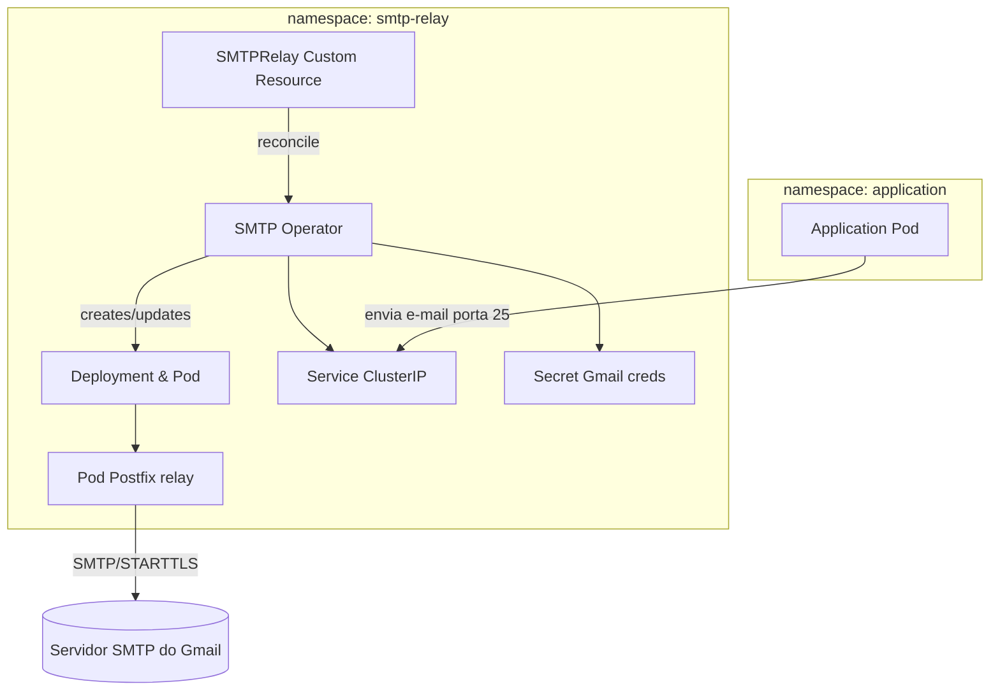

# SMTP Relay Container (Postfix + Gmail)

Este projeto fornece uma imagem de contêiner POSIX que roda **Postfix** como um relay SMTP. Ele aceita conexões sem autenticação (clientes dentro do cluster Kubernetes) e encaminha as mensagens usando uma conta Gmail configurada via variáveis de ambiente.

---

## Como funciona

1. O Pod expõe porta `25` e aceita e-mails de aplicações (clientes) sem autenticação.
2. Um `entrypoint.sh` configura dinamicamente o `main.cf` do Postfix com as credenciais do Gmail.
3. O Postfix autentica-se no servidor SMTP do Gmail (`smtp.gmail.com:587`) e encaminha as mensagens.

## Variáveis de ambiente obrigatórias

| Variável | Descrição |
|----------|-----------|
| `RELAY_USER` | Conta Gmail completa (ex: user@gmail.com) |
| `RELAY_PASSWORD` | Senha ou App Password do Gmail |
| `MYDOMAIN` *(opcional)* | Nome de host que o Postfix anunciará |


## Como construir a imagem

O código-fonte da imagem está dentro do subdiretório `smtp-app`.

```sh
cd smtp-app
# opcional: ajuste nome da imagem e tag
docker build -t myregistry/smtp-relay:latest .
```

Substitua `myregistry` pelo repositório de sua escolha.

> **Observação**: o diretório `smtp-app` contém também o `entrypoint.sh` usado pelo Dockerfile, consulte-o se precisar alterar a configuração do Postfix.

### Exemplo de execução local

Para testar sem Kubernetes, execute um contêiner passando as variáveis de ambiente:

```sh
docker run --rm -p 25:25 \
  -e RELAY_USER=you@gmail.com \
  -e RELAY_PASSWORD="suaSenha" \
  -e MYDOMAIN="smtp-relay.default.svc.cluster.local" \
  myregistry/smtp-relay:latest
```

O `--rm` remove o contêiner ao final e `-p 25:25` expõe a porta SMTP. Ajuste nome/tag conforme o que você construiu.

## Uso em Kubernetes

Os manifestos Kubernetes estão no diretório `manifests`.

1. **Crie um secret** com as credenciais do Gmail (substitua valores reais):

```sh
kubectl apply -f manifests/secret.yaml
```

2. **Deslize os recursos**:

```sh
kubectl apply -f manifests/deployment.yaml
kubectl apply -f manifests/service.yaml
```

> Se necessário ajuste o namespace ou o nome do secret.

Os pods clientes podem então enviar e-mail para `smtp-relay.default.svc.cluster.local:25` (ajuste o namespace conforme necessário).

Exemplo de envio de um pod cliente (sem autenticação):

```sh
# crie um pod transitório com utilitários de rede
kubectl run -it --rm smtp-test --image=alpine -- ash
# dentro do pod execute um dos comandos abaixo:
#
# usando sendmail (se o pod tiver Postfix ou equivalente):
# echo -e "Subject: teste\n\ncorpo" | sendmail destinatario@exemplo.com
#
# usando msmtp (instale com apk add msmtp no Alpine):
# echo -e "Subject: teste\n\ncorpo" | msmtp --host=smtp-relay.default.svc.cluster.local --port=25 destinatario@exemplo.com
#
# ou com netcat/telnet:
#   { echo "EHLO localhost"; echo "MAIL FROM:<remetente@example.com>"; echo "RCPT TO:<destinatario@exemplo.com>"; echo "DATA"; echo "Subject: teste"; echo; echo "corpo"; echo "."; echo "QUIT"; } | nc smtp-relay.default.svc.cluster.local 25
```

Se preferir criar um pod separado e depois usar `kubectl exec`:

```sh
kubectl apply -f - <<'EOF'
apiVersion: v1
kind: Pod
metadata:
  name: smtp-client
spec:
  containers:
  - name: client
    image: alpine
    command: ["sleep","3600"]
EOF

# executar comando no pod recém-criado
echo -e "Subject: teste\n\ncorpo" | kubectl exec -i smtp-client -- sendmail destinatario@exemplo.com
```

> **Nota**: O Gmail exige que você use uma senha de aplicativo se 2FA estiver habilitado.

## Manifestos Kubernetes

Os arquivos YAML em `k8s/` descrevem:

- `ConfigMap` para armazenar configurações estáticas caso necessário
- `Deployment` que define réplicas do serviço de relay
- `Service` de tipo `ClusterIP` para expor porta 25

> Ajuste rótulos, namespaces e recursos de acordo com a sua infraestrutura.

---

Sinta‑se livre para adaptar conforme as políticas de segurança do seu cluster. Essa imagem **não** faz nenhuma validação do remetente ou do conteúdo; use-a exclusivamente em redes confiáveis ou adicione controles adicionais conforme necessário.

## Funcionamento do Operator

Quando usado como um operador Kubernetes, o controlador observa recursos customizados (por exemplo, `SMTPRelay`) e garante que a infraestrutura
esteja alinhada com a especificação desejada. O fluxo típico é:



Esse diagrama mostra o loop de reconciliação e como o operador gera/atualiza os objetos Kubernetes necessários
(e adaptações similares podem ser aplicadas para outras configurações).

### Diagrama com o funcionamento


