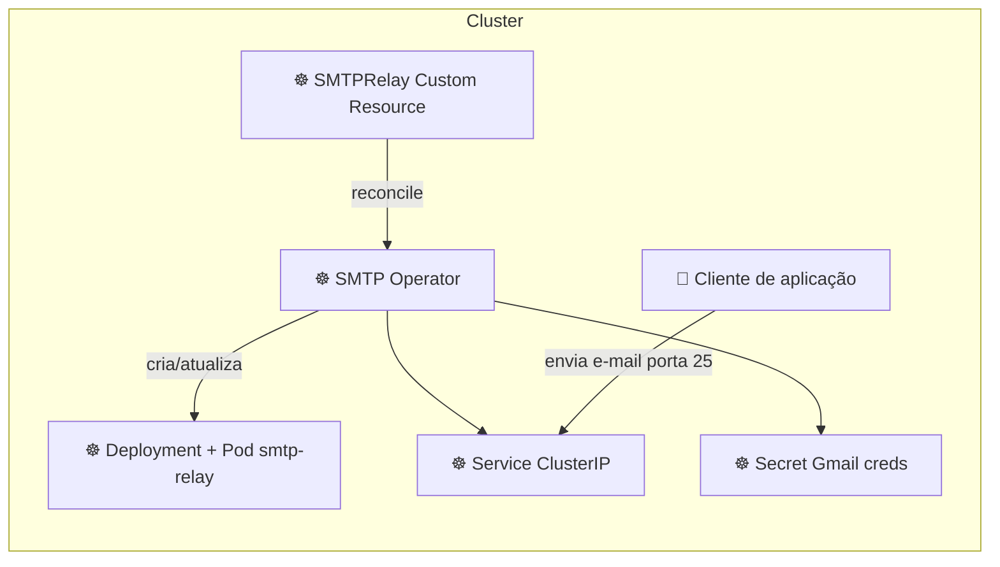

# SMTP Relay Container (Postfix + Gmail)

Este projeto fornece uma imagem de contêiner POSIX que roda **Postfix** como um relay SMTP. Ele aceita conexões sem autenticação (clientes dentro do cluster Kubernetes) e encaminha as mensagens usando uma conta Gmail configurada via variáveis de ambiente.

---

## Como funciona

1. O Pod expõe porta `25` e aceita e-mails de aplicações (clientes) sem autenticação.
2. Um `entrypoint.sh` configura dinamicamente o `main.cf` do Postfix com as credenciais do Gmail.
3. O Postfix autentica-se no servidor SMTP do Gmail (`smtp.gmail.com:587`) e encaminha as mensagens.

## Variáveis de ambiente obrigatórias

| Variável | Descrição |
|----------|-----------|
| `RELAY_USER` | Conta Gmail completa (ex: user@gmail.com) |
| `RELAY_PASSWORD` | Senha ou App Password do Gmail |
| `MYDOMAIN` *(opcional)* | Nome de host que o Postfix anunciará |


## Como construir a imagem

```sh
cd smtp-relay
docker build -t myregistry/smtp-relay:latest .
```

Substitua `myregistry` pelo repositório de sua escolha.

## Uso em Kubernetes

1. **Crie um secret** com as credenciais do Gmail (substitua valores reais):

```sh
kubectl apply -f k8s/secret.yaml
```

2. **Deslize os recursos**:

```sh
kubectl apply -f k8s/deployment.yaml
kubectl apply -f k8s/service.yaml
```

> Se necessário ajuste o namespace ou o nome do secret.

Os pods clientes podem então enviar e-mail para `smtp-relay.default.svc.cluster.local:25` (ajuste o namespace conforme necessário).

Exemplo de envio de um pod cliente:

```sh
# dentro de outro pod
echo -e "Subject: teste\n\ncorpo" | sendmail -S smtp-relay.default.svc.cluster.local:25 destinatario@exemplo.com
```

> **Nota**: O Gmail exige que você use uma senha de aplicativo se 2FA estiver habilitado.

## Manifestos Kubernetes

Os arquivos YAML em `k8s/` descrevem:

- `ConfigMap` para armazenar configurações estáticas caso necessário
- `Deployment` que define réplicas do serviço de relay
- `Service` de tipo `ClusterIP` para expor porta 25

> Ajuste rótulos, namespaces e recursos de acordo com a sua infraestrutura.

---

Sinta‑se livre para adaptar conforme as políticas de segurança do seu cluster. Essa imagem **não** faz nenhuma validação do remetente ou do conteúdo; use-a exclusivamente em redes confiáveis ou adicione controles adicionais conforme necessário.

## Funcionamento do Operator

Quando usado como um operador Kubernetes, o controlador observa recursos customizados (por exemplo, `SMTPRelay`) e garante que a infraestrutura
esteja alinhada com a especificação desejada. O fluxo típico é:

> **Nota sobre ícones** – o Mermaid suporta imagens, pacotes de ícones e elementos HTML na sintaxe de **architecture diagrams**.
> Consulte a documentação: https://mermaid.js.org/syntax/architecture.html#icons.
>
> - Para renderizadores que carregam JavaScript (site próprio, páginas estáticas com o bundle), você pode **registrar icon packs**:
>   ```js
>   mermaid.initialize({ startOnLoad: true });
>   mermaid.registerIconPacks([{
>       name: 'k8s',
>       loader: () => fetch('https://unpkg.com/@iconify-json/mdi/icons.json').then(r => r.json())
>   }]);
>   ```
>   Em seguida use `icon` ou `<i>` em nós, por exemplo:
>   ```mermaid
>   flowchart LR
>       pod["pod"]:::k8s
>   ```
>
> - Para o GitHub e outros visualizadores estáticos, a forma mais confiável é usar **tags ``** ou HTML `<i>` com URLs diretos:
>   ```html
>   <div class="mermaid">
>   flowchart LR
>       Pod[ Pod]
>       Deployment[ Deployment]
>       Service[ Service]
>       Pod --> Deployment --> Service
>   </div>
>   ```
>
> - Exemplo usando sintaxe de arquitetura com `<i>` (necessita pacote/iconify):
>   ```html
>   <div class="mermaid">
>   flowchart LR
>       pod[<i class="iconify" data-icon="mdi:kubernetes" data-inline="false" style="font-size:1.5rem"></i> Pod]
>       deployment[<i class="iconify" data-icon="mdi:kubernetes-deployment" data-inline="false" style="font-size:1.5rem"></i> Deployment]
>       service[<i class="iconify" data-icon="mdi:kubernetes-service" data-inline="false" style="font-size:1.5rem"></i> Service]
>       pod --> deployment --> service
>   </div>
>   ```
>
> Ajuste URLs/ícones conforme necessário para refletir pod, deployment, service, etc.
>




Esse diagrama mostra o loop de reconciliação e como o operador gera/atualiza os objetos Kubernetes necessários
(e adaptações similares podem ser aplicadas para outras configurações).


